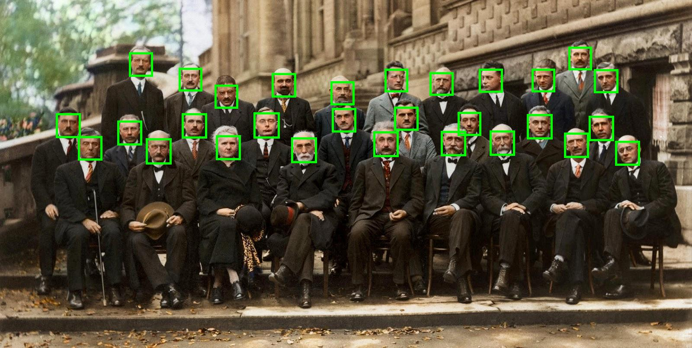
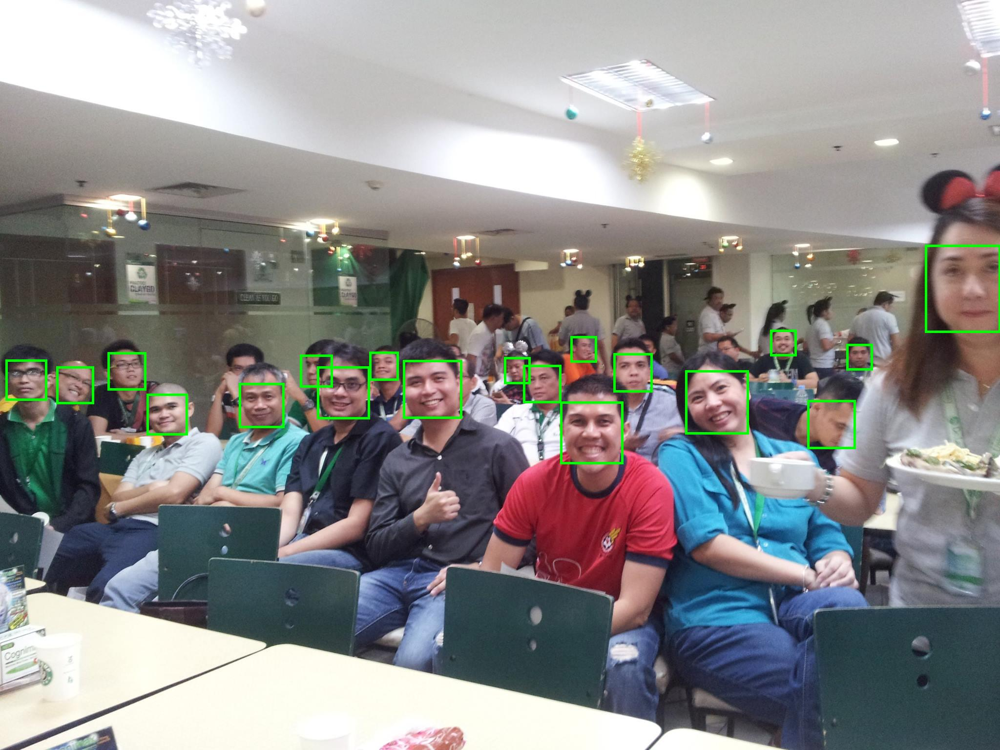
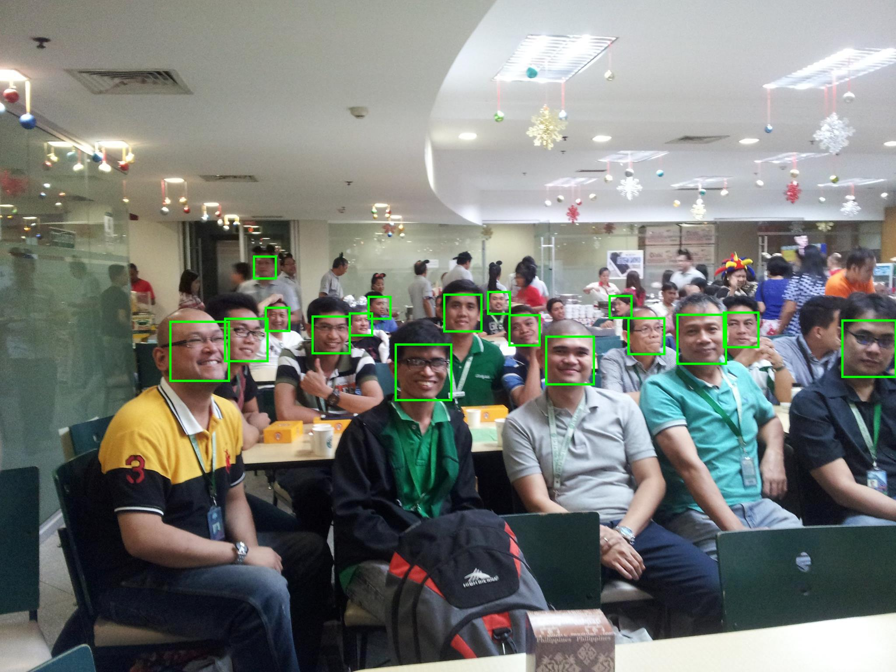
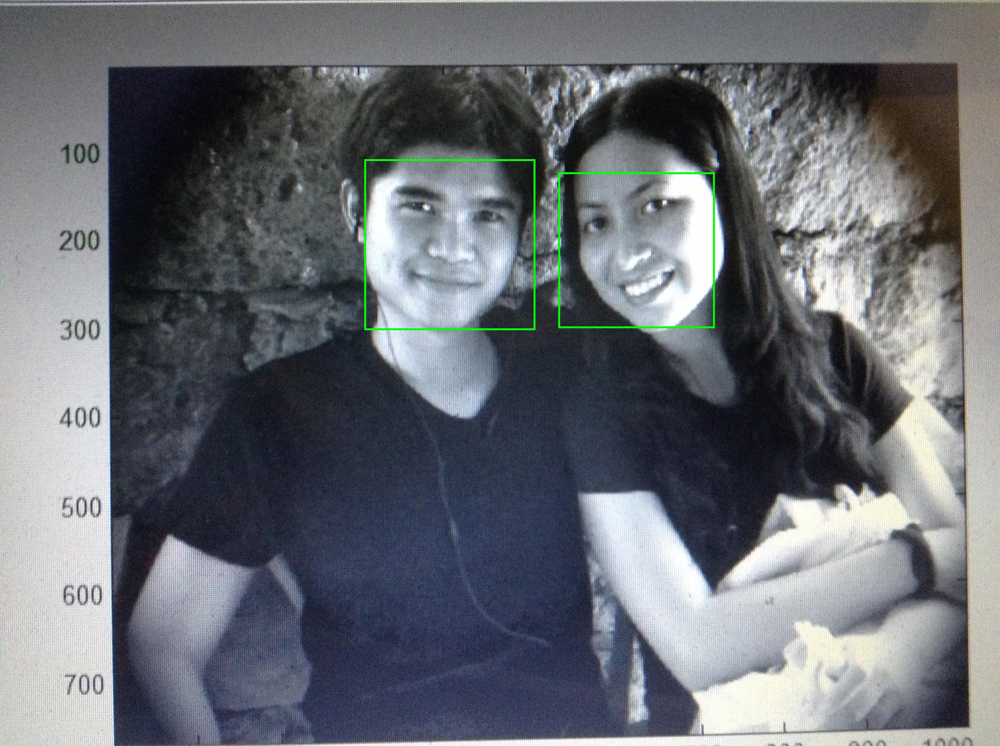
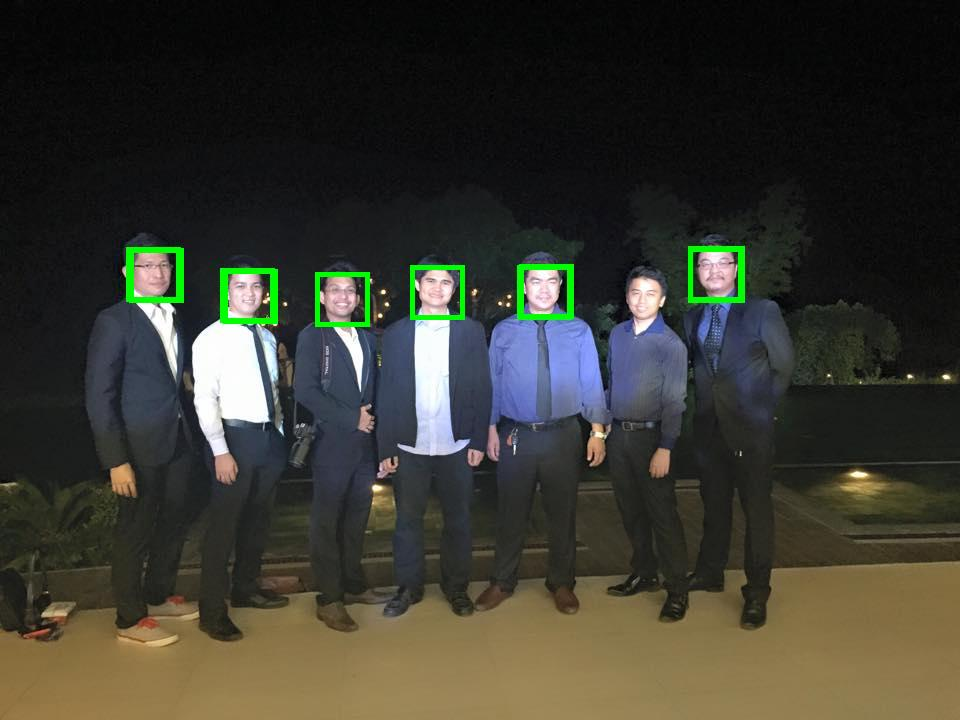
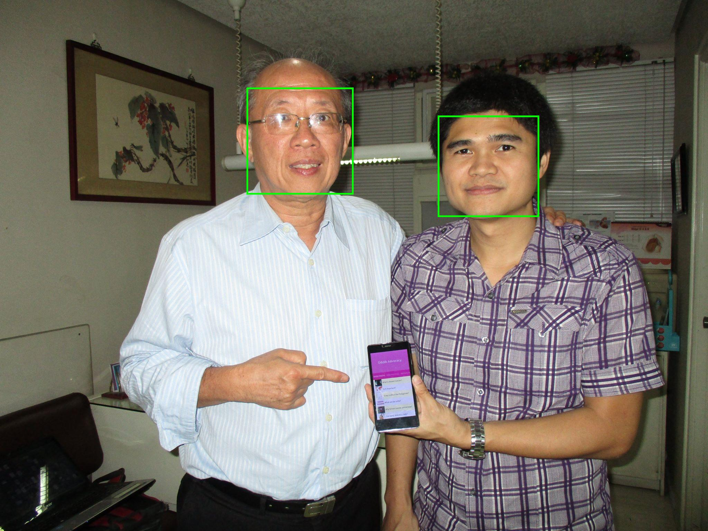

# SampleGoogleFaceDetect

## Compile:

```
mvn clean compile assembly:single
```

## Run

```
java -cp target/face-detection-1.0-SNAPSHOT-jar-with-dependencies.jar com.google.cloud.vision.samples.facedetect.FaceDetectApp /path/to/input.jpg /path/to/output.jpg
```

## Screenshots:













## Code

```
/*
 * Copyright 2016 Google Inc. All Rights Reserved.
 *
 * Licensed under the Apache License, Version 2.0 (the "License");
 * you may not use this file except in compliance with the License.
 * You may obtain a copy of the License at
 *
 * http://www.apache.org/licenses/LICENSE-2.0
 *
 * Unless required by applicable law or agreed to in writing, software
 * distributed under the License is distributed on an "AS IS" BASIS,
 * WITHOUT WARRANTIES OR CONDITIONS OF ANY KIND, either express or implied.
 * See the License for the specific language governing permissions and
 * limitations under the License.
 */

package com.google.cloud.vision.samples.facedetect;

// [BEGIN import_libraries]
import com.google.api.client.googleapis.auth.oauth2.GoogleCredential;
import com.google.api.client.googleapis.javanet.GoogleNetHttpTransport;
import com.google.api.client.json.JsonFactory;
import com.google.api.client.json.jackson2.JacksonFactory;
import com.google.api.services.vision.v1.Vision;
import com.google.api.services.vision.v1.VisionScopes;
import com.google.api.services.vision.v1.model.AnnotateImageRequest;
import com.google.api.services.vision.v1.model.BatchAnnotateImagesRequest;
import com.google.api.services.vision.v1.model.BatchAnnotateImagesResponse;
import com.google.api.services.vision.v1.model.FaceAnnotation;
import com.google.api.services.vision.v1.model.Feature;
import com.google.api.services.vision.v1.model.Image;
import com.google.api.services.vision.v1.model.Vertex;
import com.google.common.collect.ImmutableList;

import java.awt.BasicStroke;
import java.awt.Color;
import java.awt.Graphics2D;
import java.awt.Polygon;
import java.awt.image.BufferedImage;
import java.io.IOException;
import java.nio.file.Files;
import java.nio.file.Path;
import java.nio.file.Paths;
import java.security.GeneralSecurityException;
import java.util.List;

import javax.imageio.ImageIO;
// [END import_libraries]

/**
 * A sample application that uses the Vision API to detect faces in an image.
 */
@SuppressWarnings("serial")
public class FaceDetectApp {
  /**
   * Be sure to specify the name of your application. If the application name is {@code null} or
   * blank, the application will log a warning. Suggested format is "MyCompany-ProductName/1.0".
   */
  private static final String APPLICATION_NAME = "Google-VisionFaceDetectSample/1.0";

  private static final int MAX_RESULTS = 30;

  // [START main]
  /**
   * Annotates an image using the Vision API.
   */
  public static void main(String[] args) throws IOException, GeneralSecurityException {
    if (args.length != 2) {
      System.err.println("Usage:");
      System.err.printf(
          "\tjava %s inputImagePath outputImagePath\n",
          FaceDetectApp.class.getCanonicalName());
      System.exit(1);
    }
    Path inputPath = Paths.get(args[0]);
    Path outputPath = Paths.get(args[1]);
    if (!outputPath.toString().toLowerCase().endsWith(".jpg")) {
      System.err.println("outputImagePath must have the file extension 'jpg'.");
      System.exit(1);
    }

    FaceDetectApp app = new FaceDetectApp(getVisionService());
    List<FaceAnnotation> faces = app.detectFaces(inputPath, MAX_RESULTS);
    System.out.printf("Found %d face%s\n", faces.size(), faces.size() == 1 ? "" : "s");
    System.out.printf("Writing to file %s\n", outputPath);
    app.writeWithFaces(inputPath, outputPath, faces);
  }
  // [END main]

  // [START get_vision_service]
  /**
   * Connects to the Vision API using Application Default Credentials.
   */
  public static Vision getVisionService() throws IOException, GeneralSecurityException {
    GoogleCredential credential =
        GoogleCredential.getApplicationDefault().createScoped(VisionScopes.all());
    JsonFactory jsonFactory = JacksonFactory.getDefaultInstance();
    return new Vision.Builder(GoogleNetHttpTransport.newTrustedTransport(), jsonFactory, credential)
            .setApplicationName(APPLICATION_NAME)
            .build();
  }
  // [END get_vision_service]

  private final Vision vision;

  /**
   * Constructs a {@link FaceDetectApp} which connects to the Vision API.
   */
  public FaceDetectApp(Vision vision) {
    this.vision = vision;
  }

  // [START detect_face]
  /**
   * Gets up to {@code maxResults} faces for an image stored at {@code path}.
   */
  public List<FaceAnnotation> detectFaces(Path path, int maxResults) throws IOException {
    byte[] data = Files.readAllBytes(path);

    AnnotateImageRequest request =
        new AnnotateImageRequest()
            .setImage(new Image().encodeContent(data))
            .setFeatures(ImmutableList.of(
                new Feature()
                    .setType("FACE_DETECTION")
                    .setMaxResults(maxResults)));
    Vision.Images.Annotate annotate =
        vision.images()
            .annotate(new BatchAnnotateImagesRequest().setRequests(ImmutableList.of(request)));
    // Due to a bug: requests to Vision API containing large images fail when GZipped.
    annotate.setDisableGZipContent(true);

    BatchAnnotateImagesResponse response = annotate.execute();
    return response.getResponses().get(0).getFaceAnnotations();
  }
  // [END detect_face]

  // [START highlight_faces]
  /**
   * Reads image {@code inputPath} and writes {@code outputPath} with {@code faces} outlined.
   */
  private static void writeWithFaces(Path inputPath, Path outputPath, List<FaceAnnotation> faces)
      throws IOException {
    BufferedImage img = ImageIO.read(inputPath.toFile());
    annotateWithFaces(img, faces);
    ImageIO.write(img, "jpg", outputPath.toFile());
  }

  /**
   * Annotates an image {@code img} with a polygon around each face in {@code faces}.
   */
  public static void annotateWithFaces(BufferedImage img, List<FaceAnnotation> faces) {
    for (FaceAnnotation face : faces) {
      annotateWithFace(img, face);
    }
  }

  /**
   * Annotates an image {@code img} with a polygon defined by {@code face}.
   */
  private static void annotateWithFace(BufferedImage img, FaceAnnotation face) {
    Graphics2D gfx = img.createGraphics();
    Polygon poly = new Polygon();
    for (Vertex vertex : face.getFdBoundingPoly().getVertices()) {
      poly.addPoint(vertex.getX(), vertex.getY());
    }
    gfx.setStroke(new BasicStroke(5));
    gfx.setColor(new Color(0x00ff00));
    gfx.draw(poly);
  }
  // [END highlight_faces]
}
```
